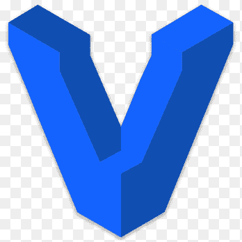
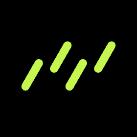

<h1 align="left" id="utsavdesai-title">Hello, I'm <a href="https://github.com/UtsavDesai26">Utsav Desai</a> </h1>

  
  
  

## About Me 🚀

I'm a passionate **Tech Enthusiast 💻 😃** and a graduate student majoring in Information Technology at [CSPIT – Chandubhai S. Patel Institute of Technology 🅾️](https://www.charusat.ac.in/cspit/). I thrive on learning and enjoy building innovative products that serve a meaningful purpose.

### 📬 Find me at

## Quick Facts ⚡️

- 🔭 I’m currently working as a Full Stack Developer at **[@ Softrefine Technology Pvt Ltd. - IT Company 🅾️](https://softrefine.com/)**
-  I enjoy working on
  - 📊 Web Development using **ReactJS, NodeJS, ExpressJS, MongoDB**
  - 📱 Mobile Apps Development using **Flutter**
  - 📊 DevOps stuff using **AWS, Docker, Jenkins, Kubernetes, Terraform**
  - 🤖 Machine Learning using **Python, Tensorflow, Keras**
- 📝 I regulary write articles on **[Medium](https://medium.com/@utsavdesai26)**
- 📫 How to reach me: **[Mail](mailto:desaiutsav26@gmail.com)**
- 📙 Check out my **[Resume](https://www.linkedin.com/in/utsavdesai26/)**
- 💬 Ping me about **Web Development**, **App Development** **DevOps**, **Machine Learning**, **Competitive Programming**, **Open Source**

## Tech Stack 💻

### Languages 🚀

> I'm proficient in various languages, including:

<table>
  <tr>
  <td align="center" width="96">
      
       C
    </td>
    <td align="center" width="96">
      
       C++
    </td>
    <td align="center" width="96">
      
       HTML
    </td>
    <td align="center" width="96">
      
       CSS
    </td>
    <td align="center" width="96">
      
       Sass
    </td>
    <td align="center" width="96">
      
       JavaScript
    </td>
    <td align="center" width="96">
      
       Typescript
    </td>
    <td align="center" width="96">
      
       Python
    </td>
    <td align="center"  width="96">
      
       Dart
    </td>
  </tr>
</table>

### Frontend 🎨

> I specialize in Frontend technologies like:

<table>
  <tr>
    <td align="center" width="96" margin="10">
      
       React
    </td>
    <td align="center" width="96">
      
       Tailwind CSS
    </td>
    <td align="center" width="96">
      
       Flutter
    </td>
    <td align="center" width="96">
      
       Ant Design
    </td>
    <td align="center" width="96">
      
       Material UI
    </td>
    <td align="center" width="96">
      
       Bootstrap
    </td>
  </tr>
</table>

### Backend 🌐

> I specialize in Backend services like:

<table>
  <tr>
    <td align="center" width="96" margin="10">
      
       NodeJS
    </td>
    <td align="center" width="96">
      
       ExpressJS
    </td>
    <td align="center" width="96">
      
       Firebase
    </td>
  </tr>
</table>

### Databases 🛢️

> I work with various databases, including:

<table>
  <tr>
    <td align="center" width="96" margin="10">
      
       MongoDB
    </td>
    <td align="center" width="96">
      
       PostgreSQL
    </td>
    <td align="center" width="96">
      
       MySQL
    </td>
  </tr>
</table>

## DevOps 🚀

> In the DevOps realm, I use services like:

<table>
  <tr>
    <td align="center" width="96" margin="10">
      
       AWS
    </td>
    <td align="center" width="96">
      
       Docker
    </td>
    <td align="center" width="96">
      
       Jenkins
    </td>
    <td align="center" width="96">
      
       Kubernetes
    </td>
    <td align="center" width="96">
      
       Terraform
    </td>
    <td align="center" width="96">
      
       Vagrant
    </td>
  </tr>
</table>

### ORM Tools 🛠️

> I leverage ORM tools such as:

<table>
  <tr>
  <td align="center" width="96">
      
       Prisma
    </td>
    <td align="center" width="96">
      
       Mongoose
    </td>
    <td align="center" width="96" margin="10">
      
       Drizzle
    </td>
  </tr>
</table>

## DevSetup 🖥️

             

## Most Used Languages 📈

## Github Stats 📊

